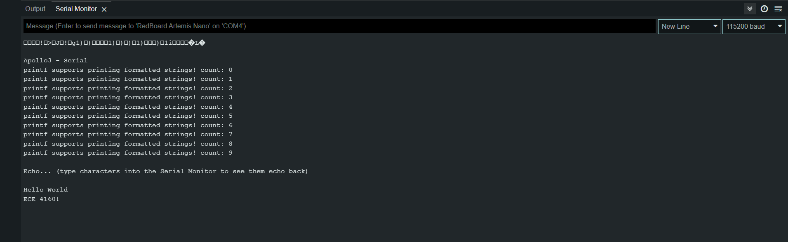
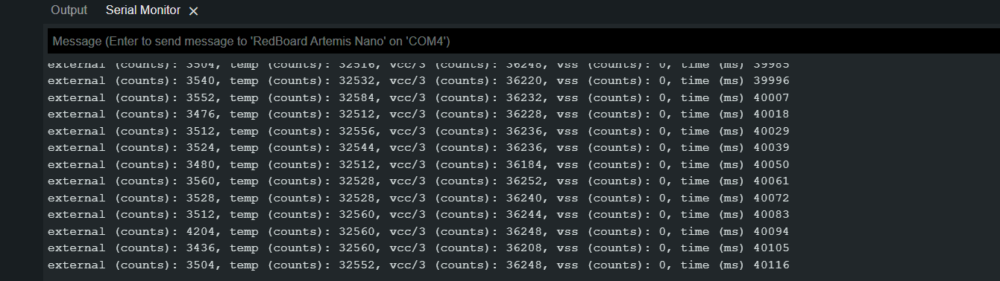
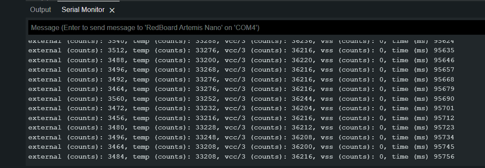
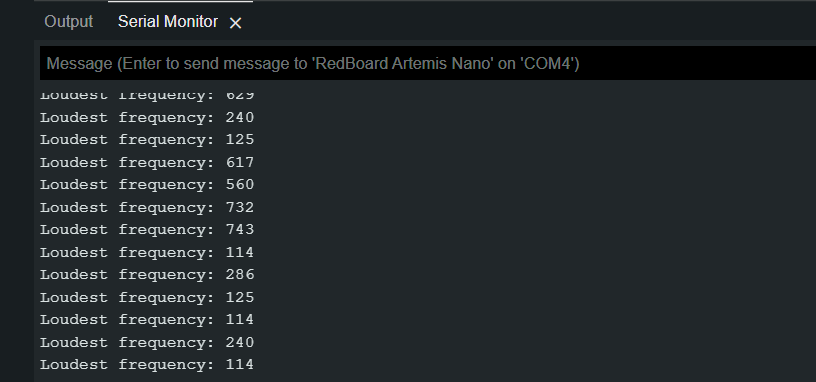
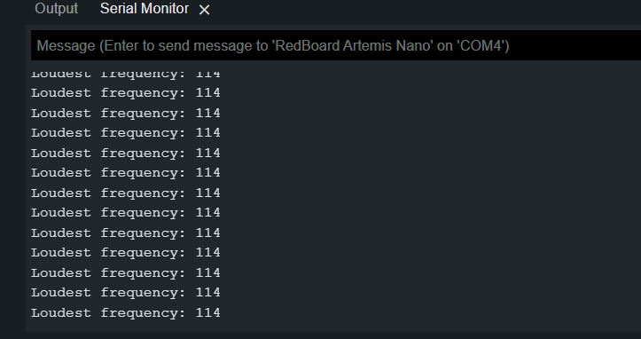
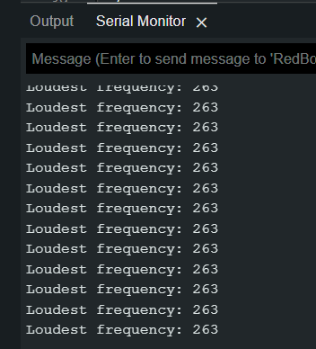

## Introduction

This week in lab I configured my laptop to deploy code to the Artemis board using the Arduino IDE.

## Process

First I downloaded and installed the Arduino IDE and the Sparkfun Apollo support software according to the documentation pages.

I was able to upload the blink example with no issues. You can see the board executing the blinking code below:

<iframe width="411" height="730" src="https://www.youtube.com/embed/1FI0Ik1U8eg" title="ECE 4160 - Blink Test" frameborder="0" allow="accelerometer; autoplay; clipboard-write; encrypted-media; gyroscope; picture-in-picture; web-share" allowfullscreen></iframe>

I then tested serial communication using the serial example code. This resulted in the serial console shown below. I was able to send messages to the Artemis from my laptop, and the Artemis echoed them back to me:

Next I tested the temperature sensor. After uploading the analogRead example code, I observed the following values from the serial monitor:

I then wrapped my hand around the Artemis, raising the temperature of the board. This resulted in elevated readings in the serial monitor:

Finally, I tested the onboard microphone. I uploaded the MicrophoneOutput example code and initially observed the following readings with ambient noise in the room:

I then used a tone generator on my phone to generate tones at various frequencies. The following screenshots show readings while a 114 Hz and 263 Hz tone was playing, respectively.

## Conclusions

With the various systems onboard the Artemis tested, I am confident that the board will be functional for future labs.