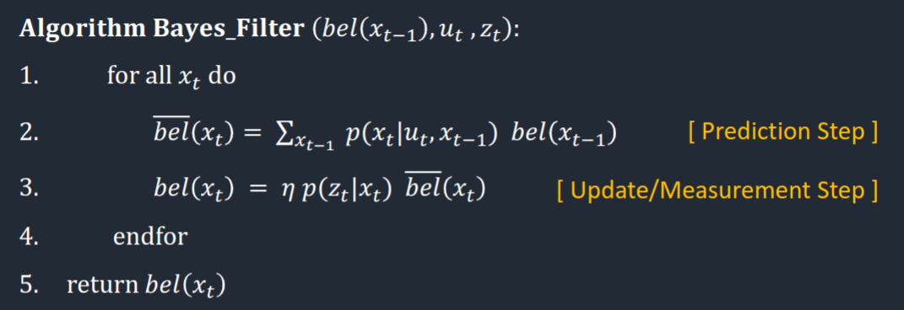

## Introduction

In this lab I used a bayes filter to localize the robot in a simulated environment.

## Prelab

Before attempting the lab, I needed to get the simulator running on my computer. I followed the [installation instructions](https://cei-lab.github.io/FastRobots-2023/FastRobots-Sim.html) for the Ubuntu partition on my laptop. The only issue I encountered was Ubuntu complaining that the Box2D pip wheel didn't support my OS, so I just installed from source. With the simulator running, I learned about the functions by implementing closed loop wall avoidance. Because my real robot has two sensors to the front of the robot, I edited /config/world.yml to include two sensors:

```yaml
# Specify the angles (in a counter-clockwise direction) for the ToF sensor(s) where 0 degrees is at the robot's heading
angles: 
    - -20
    - 20
```

Below is my code and a video showing the results.

```python
cmdr.reset_plotter()
cmdr.reset_sim()

while cmdr.sim_is_running() and cmdr.plotter_is_running():
    pose, gt_pose = cmdr.get_pose()
    cmdr.plot_odom(pose[0], pose[1])
    cmdr.plot_gt(gt_pose[0], gt_pose[1])
    
    dist_right = cmdr.get_sensor()[0]
    right_contrib = -0.5/(dist_right * dist_right)
    dist_left = cmdr.get_sensor()[1]
    left_contrib = -0.5/(dist_left * dist_left)
    
    cmdr.set_vel(1, right_contrib + left_contrib)
```

<iframe width="492" height="875" src="https://www.youtube.com/embed/HD-ApRYbShs" title="ECE 4160 - Closed Loop Sim Control" frameborder="0" allow="accelerometer; autoplay; clipboard-write; encrypted-media; gyroscope; picture-in-picture; web-share" allowfullscreen></iframe>

## Theory Behind the Bayes Filter

The Bayes Filter is a probabilistic approach that calculates the distribution of some quantity over a discretized state space. In this case the quantity is the robot's pose (x, y, theta) and the discretized space is the map divided into 1 m squares with possible poses divided every 20 degrees. This translates into a 3D grid of size (12, 9, 19), which is small enough to compute over fully.

The Bayes filter algorithm is as follows:



Where $bel(x_{t-1})$ is the belief distribution before running the filter,
$u_t$ is the commands we gave the robot in this time-step,
and $z_t$ is the sensor measurements for this time-step.

The filter iterates over every pose $x_t$ and computes the probably that it's the true pose given the input variables. The first step is the prediction step, which finds how likely the state is given the previous state and our command. If we tell the car to move forward, we would expect the car to execute that command and actually move according to our understanding of it's dynamics. This should cause the distribution to move accordingly, and is factored into the calculation.

Using only the update step is equivalent to relying entirely on odometry, which previous experiments have shown is an unreliable approach. To solve this problem, we integrate the update step. The update step uses sensor measurements and a sensor model to compare the predicted sensor measurements for $x_t$ to the observed values. The result is a probability representing how likely it is that the sensor measurements were taken from that pose.

## Fixing an Issue With the Sim

An oversight in the simulator results in mapper.get_views not respecting custom sensor arrangements. Regardless of sensor configuration, the function caches data from a single sensor pointed straight forward.

I edited the mapper class to respect the sensor configuration, with the most notable edit to the get_views method:

```python
for j in range(0, self.SENSOR_COUNT):
    # Calculate bearings and tracing rays
    bearings = np.arange(
        0, 360, self.RAY_TRACING_ANGLE_INCREMENT) + pose[2] + self.SENSOR_ANGLES[j]
```

The full localization.py file with relevant fixes can be [found here](https://github.com/usedhondacivic/FAST-ROBOTS-2023/blob/main/FastRobots-sim-release/localization.py).

## Implementing the Bayes Filter in Python

I used [Linda Li's](https://lyl24.github.io/lyl24-ece4960/lab11) implementation of the sensor model, movement model, and update / prediction step. I updated the model for my specific sensor arrangement, but unless noted the code was written by her.

The compute_control function takes the movement over a time step and converts it into the control command that would have caused the motion:

```python
def compute_control(cur_pose, prev_pose):
    """
    Args:
        cur_pose  ([Pose]): Current Pose
        prev_pose ([Pose]): Previous Pose 

    Returns:
        [delta_rot_1]: Rotation 1  (degrees)
        [delta_trans]: Translation (meters)
        [delta_rot_2]: Rotation 2  (degrees)
    """
    
    cur_x, cur_y, cur_theta = cur_pose
    prev_x, prev_y, prev_theta = prev_pose
    
    degrees = np.degrees(np.arctan2(cur_y - prev_y, cur_x - prev_x))
    delta_rot_1 = loc.mapper.normalize_angle(degrees - prev_theta)
    delta_trans = np.sqrt((cur_pose[0]-prev_pose[0])**2+(cur_pose[1]-prev_pose[1])**2)
    delta_rot_2 = loc.mapper.normalize_angle(cur_theta - prev_theta - delta_rot_1)
    
    return delta_rot_1, delta_trans, delta_rot_2
```

This is useful because we never directly record our robot commands. We can instead observe the robots behavior and infer the commands after the fact.

These commands are used in the odometry model to predict the probability that the robot has reached a given state based on where it was before and what we told it to do.

```python
def odom_motion_model(cur_pose, prev_pose, u):
    """
    Args:
        cur_pose  ([Pose]): Current Pose
        prev_pose ([Pose]): Previous Pose
        (rot1, trans, rot2) (float, float, float): A tuple with control data in the format 
                                                   format (rot1, trans, rot2) with units (degrees, meters, degrees)

    Returns:
        prob [float]: Probability p(x'|x, u)
    """
    
    rot1, trans, rot2 = compute_control(cur_pose, prev_pose) #actual movement
    rot1_u, trans_u, rot2_u = u #inputted movement

    rot1_prob = loc.gaussian(rot1, rot1_u, loc.odom_rot_sigma)
    trans_prob = loc.gaussian(trans, trans_u, loc.odom_trans_sigma)
    rot2_prob = loc.gaussian(rot2, rot2_u, loc.odom_rot_sigma)
    prob = rot1_prob*trans_prob*rot2_prob

    return prob
```

All of these predictions are integrated by the prediction step:

```python
def prediction_step(cur_odom, prev_odom):
    """ 
    Args:
        cur_odom  ([Pose]): Current Pose
        prev_odom ([Pose]): Previous Pose
    """
    
    u = compute_control(cur_odom, prev_odom)
    for x_prev in range(MAX_CELLS_X):
        for y_prev in range(MAX_CELLS_Y):
            for theta_prev in range(MAX_CELLS_A):
                if loc.bel[(x_prev, y_prev, theta_prev)] < 0.0001:
                    continue
                for x_cur in range(MAX_CELLS_X):
                    for y_cur in range(MAX_CELLS_Y):
                        for theta_cur in range(MAX_CELLS_A):
                            loc.bel_bar[(x_cur, y_cur, theta_cur)] += odom_motion_model(loc.mapper.from_map(x_cur, y_cur, theta_cur), loc.mapper.from_map(x_prev, y_prev, theta_prev), u)*loc.bel[(x_prev, y_prev, theta_prev)]
  
    loc.bel_bar = loc.bel_bar/np.sum(loc.bel_bar)
```

This step integrates the odometry prediction and the noise values associated with it to predict the new location and update beliefs accordingly.

Odometry is not enough to form an accurate prediction, so we update it with the data collected by the sensors:

```python
def sensor_model(obs, cur_pose):
    """ 
    Args:
        obs ([ndarray]): A 2D array consisting of the measurements made in rotation loop

    Returns:
        [ndarray]: Returns a 1D array of size 18 (=loc.OBS_PER_CELL) with the likelihood of each individual measurements
    """
    
    prob_array = []
    for i in range(18):
        prob_value_a = loc.gaussian(obs[i, 0], cur_pose[i, 0], loc.sensor_sigma)
        prob_value_b = loc.gaussian(obs[i, 1], cur_pose[i, 1], loc.sensor_sigma)
        prob_array.append(prob_value_a * prob_value_b)
    return prob_array

def update_step():
    for x in range(0, MAX_CELLS_X):
        for y in range(0, MAX_CELLS_Y):
            for theta in range(0, MAX_CELLS_A):
                loc.bel[(x, y, theta)] = np.prod(sensor_model(loc.obs_range_data,mapper.get_views(x, y, theta)))*loc.bel_bar[(x, y, theta)]

    loc.bel = loc.bel/np.sum(loc.bel) 
```

I updated Linda's sensor model to account for my two sensors in the sensor model. To simplify calculations I assumed that both sensor readings are independent, meaning that their joint probability is the product of their individual probabilities.


The update step updates our prediction by taking the product of our predicted belief with the probability that the sensor readings resulted from the predicted pose.

## Results

Here's the Bayes filter running on a robot moving in a deterministic trajectory.

<iframe width="1253" height="705" src="https://www.youtube.com/embed/H-z7aL3v3xA?start=15" title="ECE 4160 - Bayes Filter" frameborder="0" allow="accelerometer; autoplay; clipboard-write; encrypted-media; gyroscope; picture-in-picture; web-share" allowfullscreen></iframe>

The filter predicts the correct location within one grid cell for almost all time steps. Initially it has difficulty determining which way the robot goes because of the symmetry of the left and right paths, but quickly converges on the correct location.

In highly symmetric environments, sensor readings are not uniquely correlated with the pose they are taken from. That is to say, two (or more) locations might generate the same probability from the sensor update step but be very far apart. Therefore, the Bayes Filter works much better in asymmetric environments.