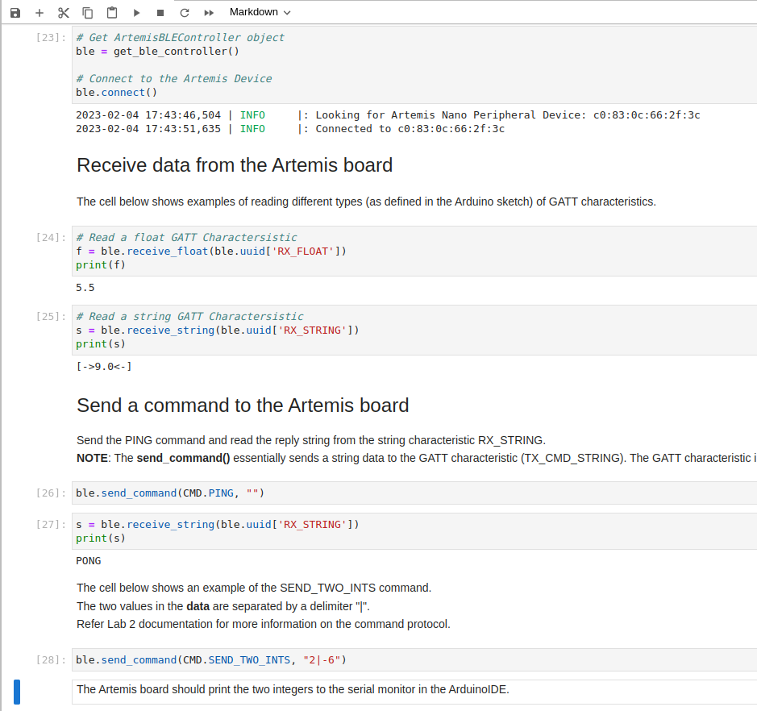
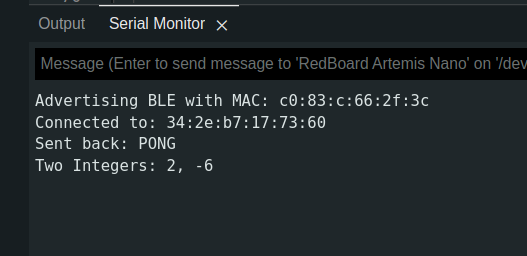
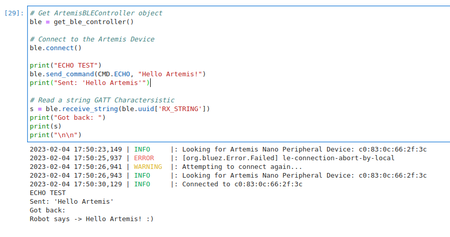

## Introduction

In this lab I established communication between my laptop and Artemis board using BLE.

## Prelab

Before I could write any code, I needed to install the necessary tools.

I first went through this process on Windows 11, which didn't work. Changes to the Windows Bluetooth drivers have been causing issues class-wide, and I decided to cut my losses and switch to Linux.

I followed [this guide](https://www.tomshardware.com/how-to/dual-boot-linux-and-windows-11) to install an Ubuntu partition on my laptop. I have previously had experience with Ubuntu through WSL, so the transition was fairly painless.

On my new Ubuntu installation I installed python and pip through the command line, and established a virtual environment. This allowed me to isolate this lab from any future python work that might break its dependencies. After installing the necessary dependencies, I could open Jupyter Notebook and begin working on demo.ipynb.

On the Arduino side, I burned the provided code onto the Artemis. This provided me with the following message:

```Advertising BLE with MAC: c0:83:c:66:2f:3c```

This MAC address is (meant to be) a unique identifier of my Artemis, allowing me to search for it among all other Bluetooth enabled devices.


My final before the lab was reading the codebase. On the Arduino side, the ArduinoBLE library is used to set up the Artemis as a BLE peripheral. The peripheral advertises one service (called testService) that offers three characteristics: `rx_characteristic_string, tx_characteristic_float, tx_characteristic_string`. These characteristics can be written too and read by the peripheral and any connected client, but we use them as their name suggests: transmission on tx and receiving on rx. 

The Python side uses the Bleak package to establish a BLE central device. These act as the clients of the BLE world, and is aware of the characteristics of the Artemis.

## Lab Tasks

### Configurations

Each service and characteristic the Artemis advertises also needs a unique identifier for the laptop to query. To ensure I was the only one talking to my device, I generated a new UUID for each. The following code is from ble_arduino.ino:

```
#define BLE_UUID_TEST_SERVICE "f74736e0-f5ac-4541-959d-e6c1f1b3f55c"
#define BLE_UUID_RX_STRING "58482b00-4146-4122-be67-2d89016731a8"
#define BLE_UUID_TX_FLOAT "51eed2ce-3329-4232-b8d5-8f022aaa2d1a"
#define BLE_UUID_TX_STRING "aa71399e-0f1d-411d-ac23-7ace2936fd5e"
```

These UUID's match the ones stored in the python side's connection.yaml:

```
artemis_address: 'c0:83:0c:66:2f:3c'

ble_service: 'f74736e0-f5ac-4541-959d-e6c1f1b3f55c'

characteristics:
  TX_CMD_STRING: '58482b00-4146-4122-be67-2d89016731a8'

  RX_FLOAT: '51eed2ce-3329-4232-b8d5-8f022aaa2d1a'
  RX_STRING: 'aa71399e-0f1d-411d-ac23-7ace2936fd5e'
```

Because I am running Linux, I also had to alter line 53 in base_ble.py, as outlined in the lab instructions.

### Running demo.ipynb

We were provided with a demo file to test our BLE connection. After switching to Ubuntu, I was able to run the full file with little difficulty, resulting in the following output:




### Sending an Echo Command

An Echo command returns the message that was sent to it. In this case, I augmented the message to show that the robot was responding. This required defining a new command, which must be coordinated between the Arduino and Python code.

The arduino code is as follows:
``` 
case ECHO:

            char char_arr[MAX_MSG_SIZE];

            // Extract the next value from the command string as a character array
            success = robot_cmd.get_next_value(char_arr);
            if (!success)
                return;

            /*
             * Your code goes here.
             */
            tx_estring_value.clear();
            tx_estring_value.append("Robot says -> ");
            tx_estring_value.append(char_arr);
            tx_estring_value.append(" :)");
            tx_characteristic_string.writeValue(tx_estring_value.c_str());             
            
            break;
```

The final output was:


### Creating a Get Time Command

### Making a Notification Handler

### Writing the Get Temperature Command

### Limitations

## Conclusion