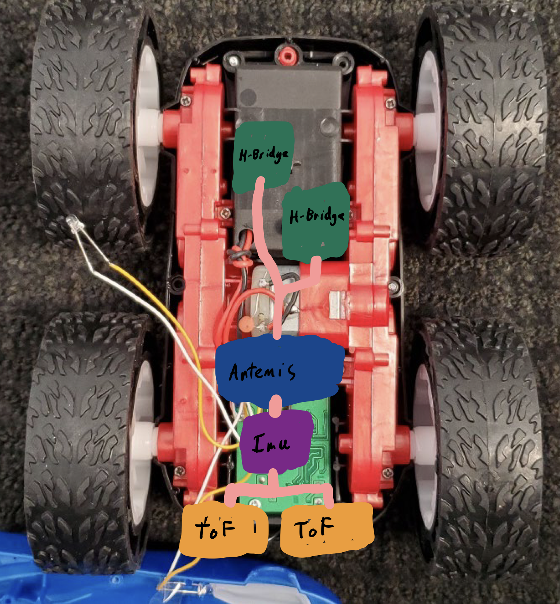
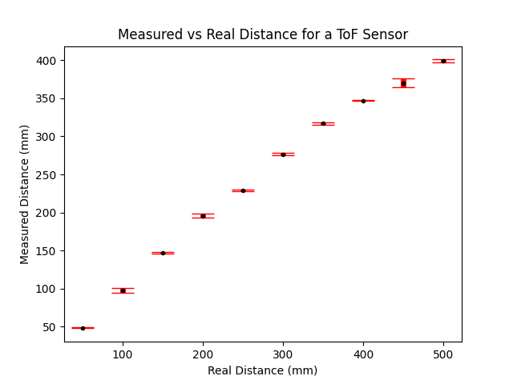
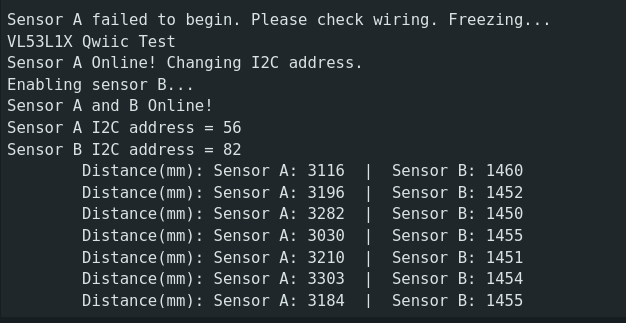
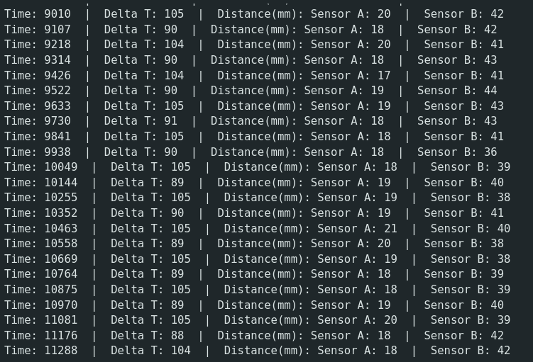
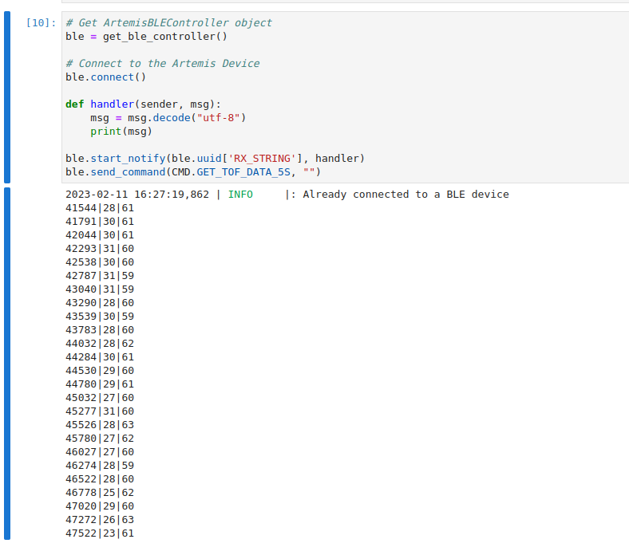
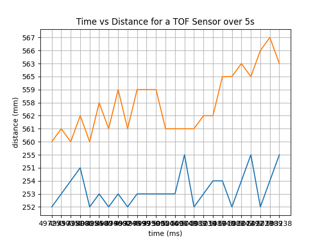

## Introduction

In this lab, I set up communication between the Artemis and a SparkFun time of flight sensor. I then benchmarked the sensor on effectiveness and wrote code to communicate with multiple sensors.

## Prelab

To communicate with an I2C peripheral, we need to know its address. The data sheet claims that the sensors use 0x52.

Because the sensors share an I2C address, I had to be careful when interfacing with them concurrently. To disambiguate the sensors, I used the shutdown pin on one sensor to disable it while I programmatically changed the I2C address of the other sensor.

I chose to use 0x38 as the other address arbitrarily, any other 8-bit address should work as well (other than 0x52 of course).

I am planning to mount both sensors on the front of my car, at slight angles to the left and right. This will let me map the room in a way analogous to human eyes.



My wiring gives the IMU the shortest cable run to minimize EMI and places the sensors and control electronics opposite from the motor drivers.

## Lab Tasks

### Connecting the sensors


I cut and soldered the provided QWIIC connectors to the two TOF sensors. They pass through a 4-way QWIIC splitter and are routed back to the Artemis.

Below is the entire system wired.


### Scanning for I2C

The Artemis libraries include an example that scans the I2C bus for peripherals and outputs their address. When run, I received the output:

```
Scanning...
I2C device found at address 0x29   !
done
```

I2C uses the LSB of the address for indicating read/write. In the data sheet, the device address is listed as 0x52, which is 0x29 << 1. Therefore the two addresses match.

### Sensor Data

To measure the accuracy and precision of the sensor, I took 10 readings every 50 mm from 50mm to 500mm. Below is a plot of the mean from the data and the standard deviation at each distance.



On average, the ranging time was 97 ms regardless of distance.

### 2 ToF Sensors

To use two sensors with the same I2C address, I toggle the enable pin on one while I change the address of the other. The SparkFun library provides a method to enable/disable the sensor, so this was fairly simple. Below is the relevant Arduino code and program output.

Arduino code:

```
distanceSensorB.sensorOff();
    if (distanceSensorA.begin() != 0) //Begin returns 0 on a good init
    {
      Serial.println("Sensor A failed to begin. Please check wiring. Freezing...");
      while (1)
        ;
    }
    Serial.println("Sensor A Online! Changing I2C address.");
    distanceSensorA.setI2CAddress(0x38);
    Serial.println("Enabling sensor B...");
    distanceSensorB.sensorOn(); // Enable B
    if (distanceSensorB.begin() != 0) //Begin returns 0 on a good init
    {
      Serial.println("Sensor B failed to begin. Please check wiring. Freezing...");
      while (1)
        ;
    }
    if(distanceSensorA.getI2CAddress() == distanceSensorB.getI2CAddress()){
      Serial.println("Error disambiguating distance sensor I2C addresses. Freezing...");
      while (1)
        ;
    }
    Serial.println("Sensor A and B Online!");
    Serial.print("Sensor A I2C address = ");
    Serial.println(distanceSensorA.getI2CAddress());
    Serial.print("Sensor B I2C address = ");
    Serial.println(distanceSensorB.getI2CAddress());
    distanceSensorA.setDistanceModeLong();
    distanceSensorB.setDistanceModeLong();
```



### ToF Sensor Speed

When readings were taken from both sensors at maximum speed, I observed delays of between 80 and 110 ms. I took these readings using the following Arduino code:

```
while(1){
    long int reading_start = millis();
    distanceSensorA.startRanging(); //Write configuration bytes to initiate measurement
    distanceSensorB.startRanging();
    while (!distanceSensorA.checkForDataReady() || !distanceSensorB.checkForDataReady())
    {
      ;;
    }
    int distanceA = distanceSensorA.getDistance(); //Get the result of the measurement from the sensor
    int distanceB = distanceSensorB.getDistance();
    distanceSensorA.clearInterrupt();
    distanceSensorA.stopRanging();
    distanceSensorB.clearInterrupt();
    distanceSensorB.stopRanging();

    long int reading_time = millis() - reading_start;

    Serial.print("Time: ");
    Serial.print(millis());
    Serial.print("  |  Delta T: ");
    Serial.print(reading_time);
    Serial.print("  |  Distance(mm): ");
    Serial.print("Sensor A: ");
    Serial.print(distanceA);
    Serial.print("  |  Sensor B: ");
    Serial.print(distanceB);
    Serial.println();
}
```
And received the following output:



I previously measured a ranging delay of around 97 ms from the sensor. This takes up almost the entirety of the time between readings. This could be lowered by lowering the collection time given to the sensor, at the cost of less accurate readings.

### Relaying Data Over Bluetooth

Due to other overhead caused by Bluetooth communication, real-time data relaying is not practical. Instead, I store data onboard the Artemis and relay it at a later time. Below is the code to achieve this effect:

Arduino:
```
case GET_TOF_DATA_5S: {
            int tof_readings[25][3];
            for(int i = 0; i < 25; i++){
                unsigned long start = millis();
                distanceSensorA.startRanging(); //Write configuration bytes to initiate measurement
                distanceSensorB.startRanging();
                while (!distanceSensorA.checkForDataReady() || !distanceSensorB.checkForDataReady())
                {
                  ;;
                }
                int distanceA = distanceSensorA.getDistance(); //Get the result of the measurement from the sensor
                int distanceB = distanceSensorB.getDistance();
                distanceSensorA.clearInterrupt();
                distanceSensorA.stopRanging();
                distanceSensorB.clearInterrupt();
                distanceSensorB.stopRanging();

                tof_readings[i][0] = (int)millis();
                tof_readings[i][1] = distanceA;
                tof_readings[i][2] = distanceB;

                delay(start + 200 - millis()); // Around 5 times per sec                    
            }

            for(int i = 0; i < 25; i++){
                tx_estring_value.clear();
                tx_estring_value.append(tof_readings[i][0]);
                tx_estring_value.append("|");
                tx_estring_value.append(tof_readings[i][1]);
                tx_estring_value.append("|");
                tx_estring_value.append(tof_readings[i][2]);
              tx_characteristic_string.writeValue(tx_estring_value.c_str());
            }
        }break;
```

Python + output:



I also chose to plot this data using matlabplot in Jupyter Notebook. The plot is shown below:

