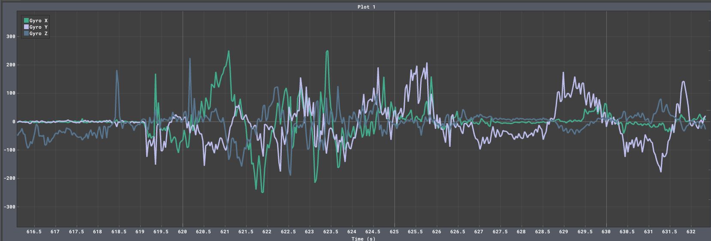

## Introduction

In this lab we setup and benchmarked a SparkFun breakout board for the ICM 20948 9DOF IMU. This device includes a gyroscope, accelerometer, and magnetometer. By fusing the sensor readings in code we can generate pose estimates for the robot's rotation.

## Setup the IMU

Setting up the IMU was easy. The breakout provides Qwiic connectors for plug-and-play wiring, and the provided library worked out of the box. 


> The wiring of the IMU, Artemis, and TOF sensors

I used the program [BetterSerialPlotter](https://hackaday.io/project/181686-better-serial-plotter) to plot some data from the accelerometer and gyroscope to ensure the IMU was functioning.



> The gyroscope data


> The accelerometer data

The IMU example code includes the line `#define AD0_VAL 1`, which sets the last bit of the sensor I2C address. This allows for multiple ICM 20948's to be used on the same I2C bus. Our IMU uses the default address, so I left the value at 1.

## Accelerometer

Using the data from the accelerometer, we can calculate the pitch and roll of the sensor. I used the following equations:

```cpp
float roll= atan2(sensor_readings.accel.y, sensor_readings.accel.z) * (180.0 / 3.14);
float pitch = atan2(sensor_readings.accel.x, sensor_readings.accel.z) * (180.0 / 3.14);
```

I then plotted the output:


> Pitch and roll calculated from the acceleration

I also plotted the roll going between +/- 90 degrees. When at 90 degrees, the acceleration in Z is close to 0. Looking at the equations for pitch on roll, we can see why this becomes an issue. 
`accel.z` is in the denominator of the calculation, and noise begins controlling the system as the value approaches 0.
This results in the noise shown on the top and bottom edges.


> Roll measured at +/- 90 degrees

Finally, I measured the precision of the calculated roll by plotting the output while the sensor was completely still. The values varied by 10 degrees.


> Roll when the sensor was stationary

To improve performance and lower the effect of noise, a low pass filter is often applied to accelerometer readings. To see how much noise was impacting my sensor I applied a fourier transform to accelerometer data collected while the sensor was sitting still.

This resulted in the following graphs:


As you can see, there is no noticeable bias towards high frequency noise in the system. This is likely because the sensor has an internal low pass that is enabled automatically on my unit. This is referenced on page 10 of [the data sheet](https://invensense.tdk.com/wp-content/uploads/2016/06/DS-000189-ICM-20948-v1.3.pdf).

## Gyroscope

Next I started incorporating the gyroscope. As seen below, the gyroscope offers a less noisy signal than the accelerometer, with the caveat of drift over time. This can be seen in the graph below, which show the gyroscope reported roll in purple and the accelerometer calculated roll in red.


> A graph of accelerometer vs gyroscope data

To get the best of both sensors, we can combine their signals using a complementary filter. This filter acts as a high-pass filter on gyroscope and a low-pass filter on the accelerometer, then combines the two. This gives the accelerometers reliability with the gyroscopes rejection of noise. Below is a plot of the filter, along with the code I used to implement it.


```cpp
float gyro_favor = 0.98;
pose.rot.x = (gyro_favor) * (pose.rot.x + myICM.gyrX() * dt) + (1.00 - gyro_favor) * (roll);
pose.rot.y = (gyro_favor) * (pose.rot.y - myICM.gyrY() * dt) + (1.00 - gyro_favor) * (pitch);
```

I hand tuned the gyro_favor factor to get the desired response. Overall I was very happy with the performance of the filter, given how simple it was to implement. As shown in the graph, the complementary output has the smoothness of the gyroscope output, yet remains inline with the average of the accelerometer data.

## Sample Data

To test the speed I am able to sample the IMU, I removed all print statements and wrote a loop that would take as many measurements as possible in one second.


> The measured data speed

This resulted in 138 samples per second.

I then setup a system to store all of my data in buffers. By storing the data locally I can have the car execute a trick and send it after it's done.

I did so using a struct holding relevant linked lists and a set of enable flags. 

```cpp
enum  BUFFER_TYPE {ACCEL, GYRO, MAG, TOF, POSE, NA};
struct {
    LinkedList<THREE_AXIS> accel;
    LinkedList<THREE_AXIS> gyro;
    LinkedList<THREE_AXIS> mag;
    LinkedList<TOF_DATA> tof;
    LinkedList<THREE_AXIS> pose_rot;


    bool enabled[5];
} data_buffers;
```

Each of these buffers can be enabled and disabled separately. By using a different buffer for each type of data, I can only store the data I need. On a memory limited system like the Artemis, this means we can take many more measurements before sending them to the laptop.

On the Python side, I can send a command to enable, disable, and read a buffer. A full cycle looks like:

```cpp
ble.send_command(CMD.ENABLE_BUFFER, "ACCEL")
time.sleep(10) # Wait for measurements
ble.send_command(CMD.DISABLE_BUFFER, "ACCEL")
ble.start_notify(ble.uuid['RX_STRING'], ble_msg_handler)
CURR_LOG_ARRAY = accel
ble.send_command(CMD.RETRIEVE_BUFFER, "POSE")
```

Executing this code fills the `CURR_LOG_ARRAY` with tuples containing timestamped data from the retrieved buffer.

## Cut the Coord

We have two LiPo batteries available for our car. One is 650mAh and the other is 800mAh. I am using a separate battery for the MCU and the motors to reduce the electromagnetic interference between the motors and sensors. 

Because the Artemis draws practically no power, I am reserving the larger battery for use with the motors. This will make the car run for longer.

To confirm the Artemis can tetherless I attached it to the car with the sensors and battery.


> The car with the Artemis, sensors, and battery attached.

## Record a Stunt

Below is a video of the car in motion and the corresponding sensor readings transmitted over BLE.

<iframe width="510" height="906" src="https://www.youtube.com/embed/D18eJpVxy1Q" title="ECE 4160: Car demo" frameborder="0" allow="accelerometer; autoplay; clipboard-write; encrypted-media; gyroscope; picture-in-picture; web-share" allowfullscreen></iframe>


Notably, the acceleration data is exceptionally noisy. This is due to my IMU placement. While taping the sensors to the car, I placed the IMU directly above the car's two motors. DC motors create a huge about of electromagnetic interference, and caused large spikes in the data. Luckily, the complementary filter did a great job of handling the situation, as seen in the pose graph. The two TOF sensors were facing the same direction on the front of the car, so it makes sense that their readings would be correlated. It seems like there might be a calibration issue however, as the readings are significantly offset.