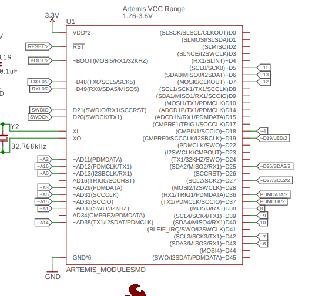
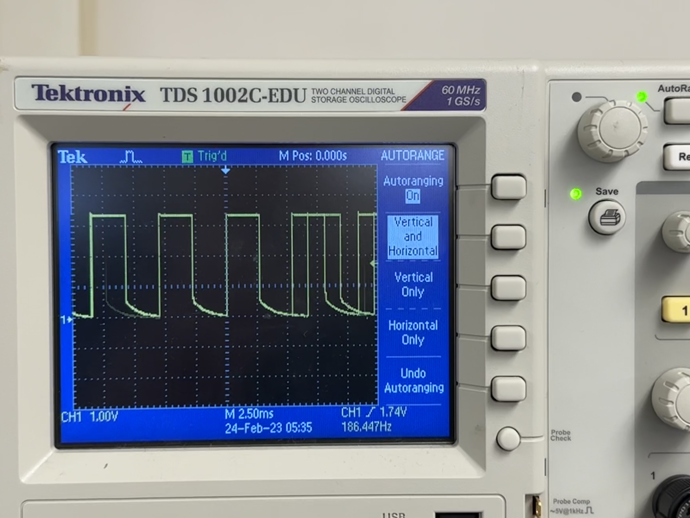

## Introduction

In this lab we integrated our electronics into a toy car. The Artemis, IMU, TOF sensors, and batteries were all wired into the cars electrical system, allowing the Artemis to control the wheels.

## Prelab

Before cutting or soldering any wires, I planned out my connections. To minimize noise, I placed the IMU as close as possible to the Artemis, and wired the two TOF sensors through it. The motor drivers are driven by two PWM pins each, which are designated on the schematic using a ~ to denote PWM functionality.



I chose pins 12 through 15 because they are spatially grouped and are PWM capable.

Additionally, the TOF sensors each need a GPIO pin to control their SHUTDOWN pins during boot up.

## Testing the Motor Driver

Before soldering all of the connections, I used an oscilloscope and bench power supply to test the motor drivers. Below is a picture of the wiring and the accompanying oscilloscope output. The bench supply is set to 3.7 V, the nominal voltage of a single cell LiPo.




The test was run using ~50% duty cycle. This is achieved using the following C code:

```cpp
analogWrite(13, 150);
analogWrite(14, 0);
```

## Assembling the Car

Once the components were confirmed functional, I soldered the rest of the connections and assembled the car. I connected the sensors to the chassis using hot glue.


## Open Loop Control

To test the system on battery power, I wrote a script that spins the car in place at oscillating speeds. Below is the code and a video showing the resulting movement.

```cpp
int t = (millis() / 10) % 510 - 255;
if(t < 0){
    t = -t;
    analogWrite(15, t);
    analogWrite(12, 0);
    analogWrite(13, t);
    analogWrite(14, 0);
}else{
    analogWrite(15, 0);
    analogWrite(12, t);
    analogWrite(13, 0);
    analogWrite(14, t);
}
```

<iframe width="100%" style="aspect-ratio: 9/5" src="https://www.youtube.com/embed/P0W7jTjzqeQ" title="ECE 4160 - Spin Test" frameborder="0" allow="accelerometer; autoplay; clipboard-write; encrypted-media; gyroscope; picture-in-picture; web-share" allowfullscreen></iframe>

I lowered the duty cycle incrementally to determine the lowest value that could overcome static friction, and found that 40/255 = ~16% duty cycle was the lowest that still made the car move.

When I attempted to drive the car in a straight line, it veered significantly to the right. This is due to inconsistency in the construction and wear of the power trains on each side of the car. To compensate, I bumped up the duty cycle of the right side by 13%, which made the car drive straight.

<iframe width="100%" style="aspect-ratio: 9/5" src="https://www.youtube.com/embed/4HccnQ2blms" title="ECE 4160 - Straight Line Test" frameborder="0" allow="accelerometer; autoplay; clipboard-write; encrypted-media; gyroscope; picture-in-picture; web-share" allowfullscreen></iframe>

I then inserted some turns and direction changes into the code, resulting in more interesting movement. Below is the code and resulting movement.

```cpp
if(millis() - start_time < 1000){
    analogWrite(15, 150);
    analogWrite(12, 0);
    analogWrite(13, 0);
    analogWrite(14, 190);
}else if(millis() - start_time < 1500){
    analogWrite(15, 150);
    analogWrite(12, 0);
    analogWrite(13, 200);
    analogWrite(14, 0);
}else if(millis() - start_time < 2500){
    analogWrite(15, 0);
    analogWrite(12, 150);
    analogWrite(13, 190);
    analogWrite(14, 0);
}else if(millis() - start_time < 3500){
    analogWrite(15, 0);
    analogWrite(12, 150);
    analogWrite(13, 0);
    analogWrite(14, 150);
}else{
    analogWrite(15, 255);
    analogWrite(12, 255);
    analogWrite(13, 255);
    analogWrite(14, 255);
}
```

<iframe width="100%" style="aspect-ratio: 9/5" src="https://www.youtube.com/embed/WaELzVR5jpI" title="ECE 4160 - Open Loop Control Test" frameborder="0" allow="accelerometer; autoplay; clipboard-write; encrypted-media; gyroscope; picture-in-picture; web-share" allowfullscreen></iframe>

