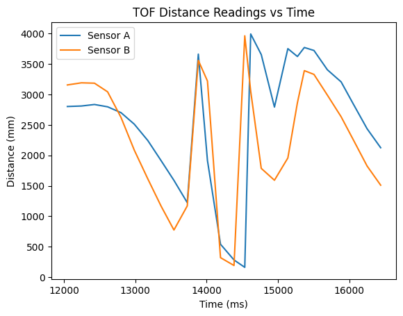
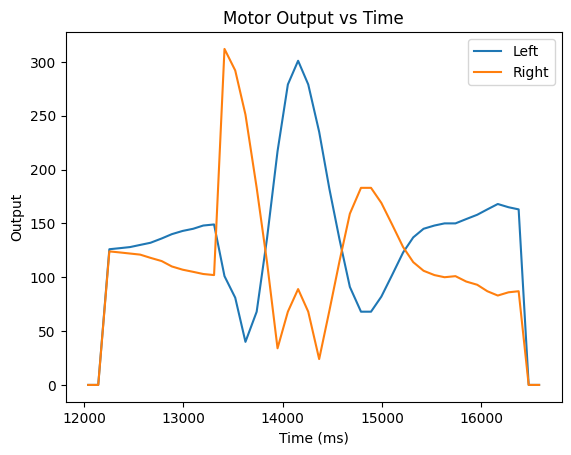
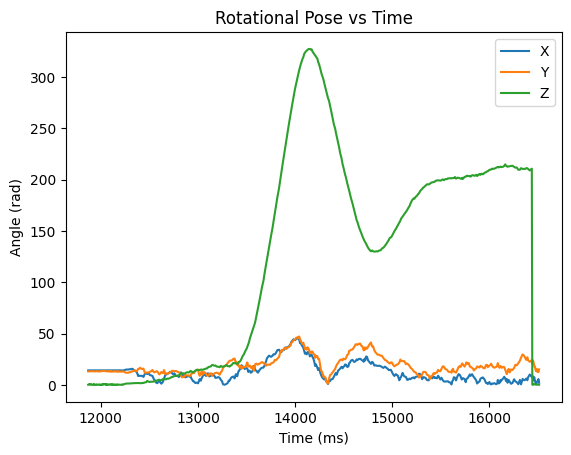

## Introduction

In this lab I used a PID controller to control the rotation of my car. This allowed me to execute a drifting turn at speed.

## Prelab

Because streaming data over BLE during the stunt would slow down the control loop speed, I instead want to store the data and relay it after the stunt is complete. For maximum configurability I created a system for enabling / disabling the car and each of its data buffers from the python client.

```cpp
enum BUFFER_TYPE { ACCEL,
                    GYRO,
                    MAG,
                    TOF,
                    POSE,
                    MOTOR,
                    BUF_NA };
static const int num_buffers = 6;
struct {
LinkedList<THREE_AXIS> accel;
LinkedList<THREE_AXIS> gyro;
LinkedList<THREE_AXIS> mag;
LinkedList<TOF_DATA> tof;
LinkedList<THREE_AXIS> pose_rot;
LinkedList<THREE_AXIS> motor_input;

bool enabled[num_buffers];
} data_buffers;
```

Each buffer is stored as a linked list, which is appended too in the sensor update function only if that buffer is enabled. Enabling / disabling and retrieving a buffer is done on the python side as follows:

```cpp
ble.send_command(CMD.ENABLE_BUFFER, "POSE")
ble.send_command(CMD.ENABLE_BUFFER, "TOF")
ble.send_command(CMD.ENABLE_BUFFER, "MOTOR")

ble.send_command(CMD.DISABLE_BUFFER, "POSE")
ble.send_command(CMD.DISABLE_BUFFER, "TOF")
ble.send_command(CMD.DISABLE_BUFFER, "MOTOR")

ble.send_command(CMD.RETRIEVE_BUFFER, "POSE")
ble.send_command(CMD.RETRIEVE_BUFFER, "TOF")
ble.send_command(CMD.RETRIEVE_BUFFER, "MOTOR")
```

Similarly, for disabling and enabling the car:

```cpp
ble.send_command(CMD.ENABLE_ROBOT, "")
ble.send_command(CMD.DISABLE_ROBOT, "")
```

And finally, I can also tune the PID gains through another command:

```cpp
ble.send_command(CMD.SET_PID_GAINS,"ROTATION:|0.005:|0.00001:|0.0")
```

## PID Implementation

My first step was implementing a PID controller in the Arduino IDE. My implementation is as follows:

```cpp
class PID_CONTROLLER {
private:
  double p;
  double i;
  double d;

  double integrator = 0;
  double integrator_cap = 1000;
  double z_prev = NULL;
  unsigned long last_time = NULL;

  int sample_rate_ms = 1;  //1khz

public:
  double output = 0;

  PID_CONTROLLER() {
    p = 0;
    i = 0;
    d = 0;
  }

  PID_CONTROLLER(double _p, double _i, double _d) {
    p = _p;
    i = _i;
    d = _d;

    if (_i != 0) {
      integrator_cap = 1 / i;
    }
  }

  void step(double u, double z) {
    unsigned long now = millis();
    if (z_prev == NULL) {
      z_prev = z;
    }
    if (last_time == NULL) {
      last_time = millis();
    }
    int dt = now - last_time;
    if (dt > sample_rate_ms) {
      double err = u - z;

      integrator += err;

      integrator = max(-integrator_cap, min(integrator_cap, integrator));

      double dz = z - z_prev;
      double der = -dz / dt;

      last_time = millis();
      z_prev = z;

      output = p * err + i * integrator + d * der;
    }
  }

  void set_gains(double _p, double _i, double _d) {
    p = _p;
    i = _i;
    d = _d;
  }
};
```

I structured the controller as a class so that I could reuse the code to create multiple PID controllers for future labs. The controller has a tunable sample rate and a setter for each of the gains. I take the derivative on measurement which minimizes derivative kick as described [in this article](http://brettbeauregard.com/blog/2011/04/improving-the-beginner%E2%80%99s-pid-derivative-kick/).

I also implemented a cap on the integral term to avoid integral windup. It is arbitrarily set to 1000 because I didn't use it for lab 6, but it might use it in future applications.

To update the controller, I use the following code:

```cpp
pid_controllers.pid[ROTATION].step(pid_controllers.setpoints[ROTATION], sensor_readings.gyro.z);
```

## PID Tuning

To test my PID controller, I created a routine to make the car hold its z orientation at 0. Below is a video of the car holding orientation while I kick it.

<iframe width="514" height="913" src="https://www.youtube.com/embed/_LP3V2O9sA0" title="ECE 4160 - PID Orientation Control" frameborder="0" allow="accelerometer; autoplay; clipboard-write; encrypted-media; gyroscope; picture-in-picture; web-share" allowfullscreen></iframe>

While developing this controller, I noticed that if I kicked the car too hard its zero point would move. This is because I was saturating the gyro's update speed, and it was unable to integrate the measurement fast enough. The library we use to interface with the gyro provides a method to set the degrees per second of the gyro, which I maxed out:

```cpp
ICM_20948_fss_t myFSS;
myFSS.g = dps2000;  // (ICM_20948_GYRO_CONFIG_1_FS_SEL_e)
                    // dps250
                    // dps500
                    // dps1000
                    // dps2000

myICM.setFullScale((ICM_20948_Internal_Acc | ICM_20948_Internal_Gyr), myFSS);
```

I also observed that the robot would often stop before its setpoint due to the motors deadband. The deadband is the range of applied voltages that are too small to overcome the static friction of the drivetrain, resulting in no motion. I resolved this by using math to map the input values outside of the deadbands.

```cpp
int deadband = 20;
int remaining_band = 255 - deadband;
int left_sign = left / abs(left);
int right_sign = right / abs(right);

int output_left = left_sign * deadband + left * remaining_band;
int output_right = right_sign * deadband + right * remaining_band;
```

## Stunt

Now that I have a routine for controlling the car's orientation, I began attempting my drift. This only required minor changes to my stationary routine, mainly adding a bias to the motor values. This causes the car to move forward while also controlling rotation. Once both sensors report that the car is within a certain distance from the wall, I change the setpoint and cause the car to whip around.

```cpp
update_sensor_readings();
update_pid_controllers();

if (pid_controllers.setpoints[ROTATION] == 0.0 &&
    sensor_readings.tof.distA < 2000 &&
    sensor_readings.tof.distB < 2000)
{
    pid_controllers.setpoints[ROTATION] = 180;
}

double turn_val = pid_controllers.pid[ROTATION].output;

set_wheel_output(0.45 -turn_val, 0.45 + turn_val);
```

And here are some videos of the stunt working!

<iframe width="514" height="913" src="https://www.youtube.com/embed/PRtbnptDNm8" title="ECE 4160 - Drift Turn 3" frameborder="0" allow="accelerometer; autoplay; clipboard-write; encrypted-media; gyroscope; picture-in-picture; web-share" allowfullscreen></iframe>

<iframe width="1280" height="720" src="https://www.youtube.com/embed/ElZs194mwh0" title="ECE 4160 - Drift Turn 2" frameborder="0" allow="accelerometer; autoplay; clipboard-write; encrypted-media; gyroscope; picture-in-picture; web-share" allowfullscreen></iframe>

<iframe width="514" height="913" src="https://www.youtube.com/embed/UEwIo8tePNc" title="ECE 4160 - Drift turn 1" frameborder="0" allow="accelerometer; autoplay; clipboard-write; encrypted-media; gyroscope; picture-in-picture; web-share" allowfullscreen></iframe>


## Data and Graphs

To ensure that the controller was behaving as intended, I logged data during the runs and graphed it after. In the graphs, you can see the setpoint moving and its effects on the motor outputs and rotation.



