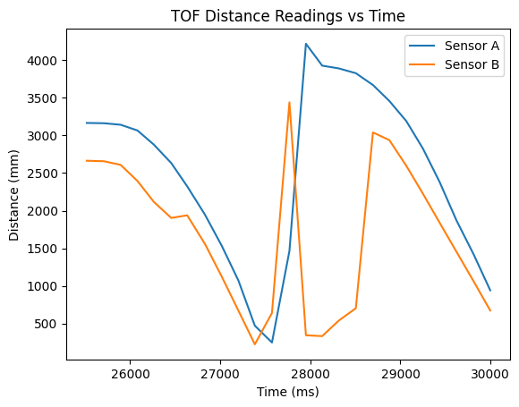
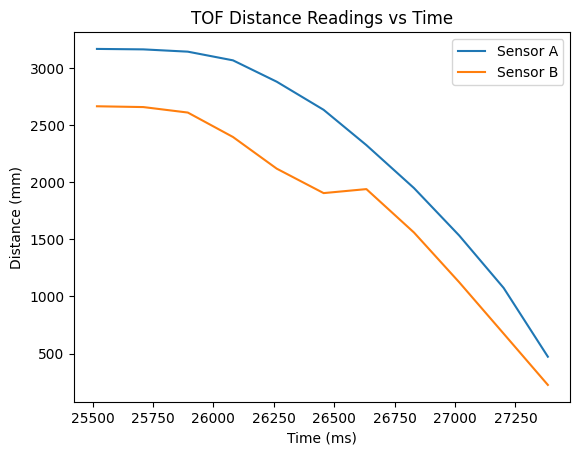
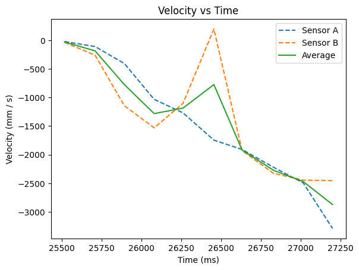
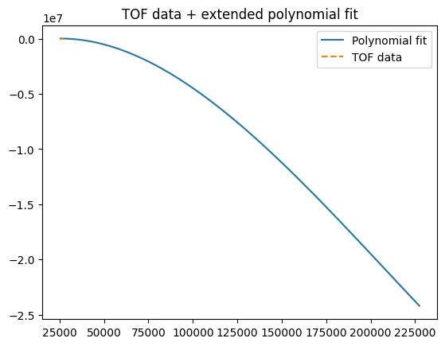
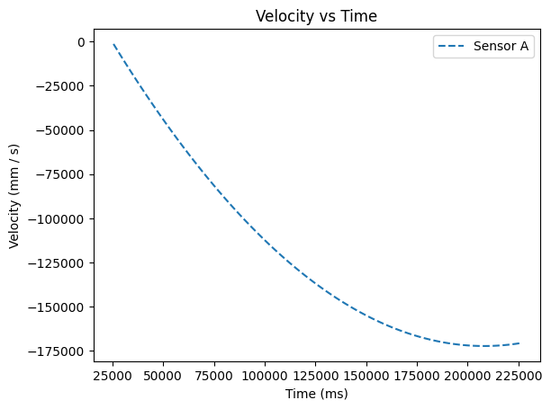
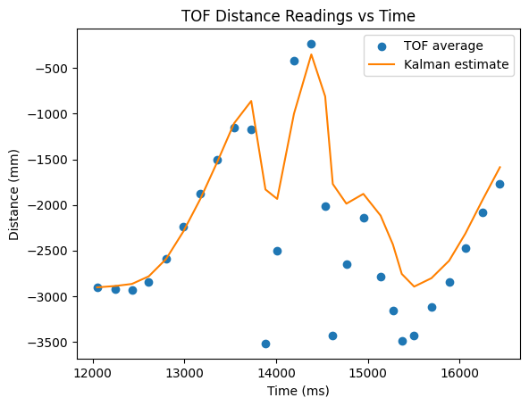
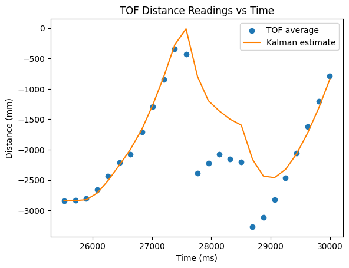
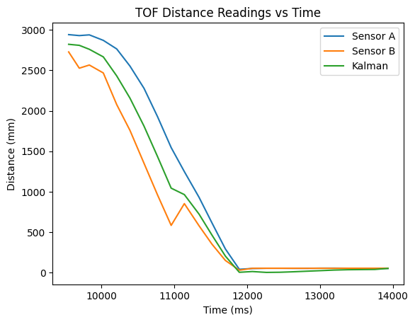

## Introduction

A key issue with the car up to this point is the speed of the control loop. The loop is limited by when it receives new data, which is the sample time of the TOF sensor. Because TOF sensors need multiple sames to get an accurate result, the sample time is around 150 ms, or 6.66 Hz. A good control loop aims to be in the kHz, so we have a problem. A Kalman filter is one way of attacking this problem.

The Kalman filter uses a model of the robots dynamics, its control inputs (what the program tells the robot to do), and estimations of the error in the system to generate a probability distribution over the location of the robot. That is to say, it predicts what the robot will do and gives a measure of its certainty. We can use this model to predict our TOF measurements even when we don't have a new measurements. This allows us to speed up the control loop by orders of magnitude.

For help on this lab, I referenced Anya Prabowo's fantastic lab report, which you can find here: [https://anyafp.github.io/ece4960/labs/lab7/](https://anyafp.github.io/ece4960/labs/lab7/)

## Establishing a Model

To use the Kalman filter we first need a model of the dynamics of the robot. As derived in class, we know that the state space equation for the car is

$$
\begin{bmatrix}
\dot{x} \\
\ddot{x}
\end{bmatrix}
=
\begin{bmatrix}
0 & 1 \\
0 & -\frac{d}{m} 
\end{bmatrix}
\begin{bmatrix}
x \\
\dot{x}
\end{bmatrix}
+
\begin{bmatrix}
0 \\
\frac{1}{m}
\end{bmatrix}
u
$$

We can find d (drag) from the steady state speed of the car, and m (momentum) from the rise time of the velocity.

I used 50% duty cycle (130 / 255) for my tests because it was the average PWM output during my stunt for lab 6. I set the car to output this to the wheels, and ran it straight into a wall.

Here is the car's TOF readings over time. You can see the point it hits the wall, after which the data isn't useful for finding our constants. I cropped the data to only the relevant range, then calculated its derivative to get the velocity of the car.







There was a box to the right side of the car on this run, resulting in a spike on the sensor B readings. Because of this, I use only sensor A's readings. As is shown in the velocity graph, the car did not reach steady state, which would result in a constant velocity.

Because I used a high speed for my car in lab 6, I was unable to get the car to reach steady state in the hallway. To find the rise time and steady state speed, I instead fitted a polynomial curve to the data and used that to find my constants. Below is the curve fitted to the TOF data + the velocity from this data.





We can see that at 50% duty cycle, the car gets to a steady state of 1.75 m/s after 200s. This seems reasonable, so I used these values to calculate my constants as:

$$
d = \frac{u}{\dot{x}} = \frac{1}{175000} = 5.71 \times 10^{-6}
$$
$$
m = \frac{-d*t_{0.9}}{\ln(0.1)} = \frac{-5.71 \times 10^{-6} \cdot 0.9 \cdot 200}{\ln(0.1)}
$$

I also needed to estimate the standard deviation of the error for the dynamics and the sensor readings. I used 10 mm and 10 mm / s for the standard deviation of the dynamics. A tenth of a meter is about how closely I hope that the robot can be tracked, so I started with that value. For the sensor readings, I looked back at my data from previous labs and estimated a standard deviation of 20 mm. In simulation these values worked well, so I stuck with them.

## Implementing the KF

Once I had found my model, all that was left to do was put it into code! Below is the python implementation of my Kalman filter.

```python
# Load in data
motor_input = np.load("motor_lab_6.npy")
motor_input = (motor_input[:, 1] + motor_input[:, 2]) / 2

tof_output = np.load("tof_lab_6.npy")
# My sensors are at an angle, so adjust for the depth. Also take the average
angle = 13 * math.pi / 180
tof_output[:, 1] = tof_output[:, 1] * np.cos(angle)
tof_output[:, 2] = tof_output[:, 2] * np.cos(angle)
tof_output[:, 1] = (tof_output[:, 1] + tof_output[:, 2]) / 2

# Calculate dynamics matrices
steady_state = 175000
t = 225-25

d = 1/steady_state
m = (-d*0.9*t)/np.log(0.1)

A = np.array([[0, 1], [0, -d/m]])
B = np.array([[0], [1/m]])
C = np.array([[-1,0]])

# This just finds the average sampling time
Delta_T = np.mean(velocity[:, 4]) / 1000.0

# Discritize the dynamics
Ad = np.eye(2) + Delta_T * A
Bd = Delta_T * B

# Set covarience
sig_u = np.array([[10**2,0],[0,10**2]])
sig_z = np.array([[20**2]])

# inital state / uncertainty
sig = np.array([[5**2,0],[0,5**2]])
x = np.array([[-tof_output[0, 1]],[0]])

def kf(mu,sigma,u,y):
    mu_p = Ad.dot(mu) + Bd.dot(u) 
    sigma_p = Ad.dot(sigma.dot(Ad.transpose())) + sig_u
    
    
    sigma_m = C.dot(sigma_p.dot(C.transpose())) + sig_z
    kkf_gain = sigma_p.dot(C.transpose().dot(np.linalg.inv(sigma_m)))

    y_m = y-C.dot(mu_p)
    mu = mu_p + kkf_gain.dot(y_m)    
    sigma=(np.eye(2)-kkf_gain.dot(C)).dot(sigma_p)

    return mu,sigma

kf_state = []

#downsample motor inputs to have an equal number of points as the tof readings
R = tof_output.shape[0]
pad_size = math.ceil(float(motor_input.size)/R)*R -motor_input.size
motor_input_padded = np.append(motor_input, np.zeros(pad_size)*np.NaN)
motor_input = np.nanmean(motor_input_padded.reshape(-1,R), axis=0)

# Run the KF
for u, d in zip(motor_input, tof_output[:, 1]):
    x, sig = kf(x, sig, np.array([[u / 130]]), np.array([[d]]))
    kf_state.append(x[:,0])
    
kf_state = np.array(kf_state).astype(float)
```

## Testing on Old Data

To sanity check my KF, I used data from my run at the wall and from lab 6 to check my that my KF output looks right. Below is the graphs from the lab 6 and lab 7 runs respectively.




The KF filter works well until the robot begins to turn or hits a wall. This makes sense, as the model is based only on the robot running straight at a wall, and doesn't account for turning.

## Implementing on the Artemis

To be useful on the robot, we need to convert the python implementation into C++ to run on the Artemis.

Here is the C++ version I wrote:

Class:

```cpp
class KALMAN_FILTER{
private:
  Matrix<2,2> A;
  Matrix<2,1> B;
  Matrix<1,2> C;

  Matrix<2,2> sig_u;
  Matrix<1, 1> sig_z;

  unsigned long last_time = NULL;

public:
  Matrix<2,1> mu;
  Matrix<2,2> sig;

  KALMAN_FILTER(){}

  KALMAN_FILTER(Matrix<2,2> A_, Matrix<2,1> B_, Matrix<1,2> C_, Matrix<2,2> _sig_u, Matrix<1,1> _sig_z){
    A = A_;
    B = B_;
    C = C_;

    sig_u = _sig_u;
    sig_z = _sig_z;
  }

  void update(Matrix<1,1> u, Matrix<1,1> y, bool update) {
    if(last_time == NULL){
      last_time = micros();
    }
    float dt = (micros() - last_time) / 1E6;

    Matrix<2,2> eye = {1, 0, 0, 1};
    Matrix<2,2> A_d = eye + A * dt;
    Matrix<2,1> B_d = B * dt;
    
    // Thanks: https://anyafp.github.io/ece4960/labs/lab7/
    Matrix<2,1> x_p = A_d*mu + B_d*u;
    Matrix<2,2> sig_p = A_d*sig*(~A_d) + sig_u;

    if(!update){
      mu = x_p;
      sig = sig_p;
      last_time = micros();
      return;
    }

    Matrix<1,1> y_curr = y;
    Matrix<1,1> y_m = y_curr - C*x_p;
    Matrix<1,1> sig_m = C*sig_p*(~C) + sig_z;

    Matrix<1,1> sig_m_inv = sig_m;
    Invert(sig_m_inv);

    Matrix<2,1> kf_gain = sig_p*(~C)*(sig_m_inv);

    // Update
    mu = x_p + kf_gain*y_m;
    sig = (eye - kf_gain*C)*sig_p;

    last_time = micros();
  }

  void set_init(Matrix<2,1> mu_init, Matrix<2,2> sig_init){
    mu = mu_init;
    sig = sig_init;   
    last_time = NULL; 
  }
};
```

Initialization:

```cpp
int steady_state = 175000;
int t = 225-25;

float d = 1/(float)steady_state;
float m = (-d*0.9*(float)t)/log(0.1);

Matrix<2,2> A = {0, 1, 0, -d/m};
Matrix<2,1> B = {0, 1/m};
Matrix<1,2> C = {-1, 0};

Matrix<2,2> sig_u = {pow(10, 2), 0, 0, pow(10, 2)};
Matrix<1,1> sig_z = {pow(20, 2)};

distance_filter = KALMAN_FILTER(A, B, C, sig_u, sig_z);

int tof_avg = (sensor_readings.tof.distA + sensor_readings.tof.distB) / 2;
Matrix<2,1> mu_init = {-(float)tof_avg, 0};
Matrix<2,2> sig_init = {pow(5, 2), 0, 0, pow(5, 2)};
distance_filter.set_init(mu_init, sig_init);
```

Reading:

```cpp
distance_filter.mu(0) // Or 1, for velocity
distance_filter.sigma(0)
```

And here is data sent from the robot of it running into a wall:



## Results

I used the Kalman filter to speed up my control loop for my stunt in lab 8! To see the results, read [that writeup](../lab_8).