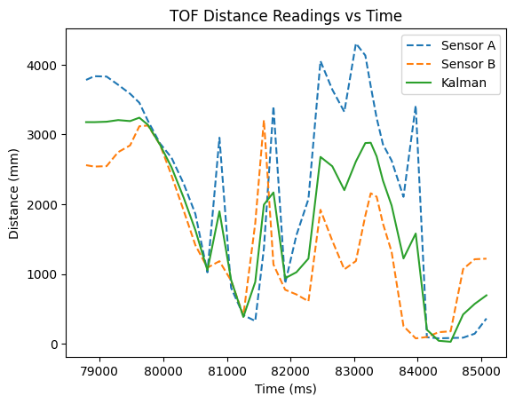
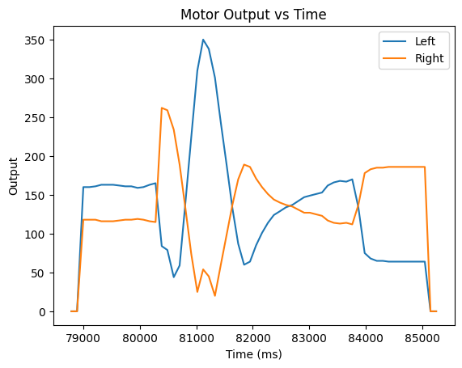

## Introduction

Finally, its time for stunts! I've constructed a robust robot and communications system so that the robot can reliably execute dynamic movements. In this lab I made the robot execute a drifting turn just before hitting a wall. My goal was to execute the manuever as quickly as possible.

## New Techniques

This stunt is very similar to what I did in lab 6. For the gorey details, see my [Lab 6 Write-up](../lab_6). It also builds on the Kalman Filter I implemented in [Lab 7](../lab_7).

The main difference between this turn and the one executed in lab 6 is the use of a Kalman filter for estimating the distance between the robot and the wall. This allows my control loop to run at 1 kHz instead of the TOF's sampling speed of ~6 Hz. Each time the motor's speed is updated I run the prediction step of the KF:

```cpp
float speed_avg = (output_left + output_right) / 2;
distance_filter.update({speed_avg / 130}, {0}, false);
```

Note that I pass 0 as the distance measurement, but it isn't used because I set the flag for executing the update step to false. I also divide the input by 130 because this was the speed I used in my calculations of the robot dynamics.
using this technique allowed me to increase the base speed of the robot up to 60% duty cycle, a 15% improvement over my lab 6. Additionally, the requirements for how close the robot is to the wall before turning is much tighter.

## Drift Turn

Below are three runs of my stunt, followed by sensor readings. All were started behind a line 12 floor tiles (~ 4m) from the wall, and began executing the turn within 3 tiles of the wall.

<iframe width="479" height="852" src="https://www.youtube.com/embed/Th6qY8N2QJw" title="ECE 4160 - KF Drift 1" frameborder="0" allow="accelerometer; autoplay; clipboard-write; encrypted-media; gyroscope; picture-in-picture; web-share" allowfullscreen></iframe>

Stunt time: 4.35 seconds

<iframe width="479" height="852" src="https://www.youtube.com/embed/RL1tla4QbUk" title="ECE 4160 - KF Drift 2" frameborder="0" allow="accelerometer; autoplay; clipboard-write; encrypted-media; gyroscope; picture-in-picture; web-share" allowfullscreen></iframe>

Stunt time: 4.68 seconds

<iframe width="479" height="852" src="https://www.youtube.com/embed/_Rr1SZRvcYo" title="ECE 4160 - KF Drift 3" frameborder="0" allow="accelerometer; autoplay; clipboard-write; encrypted-media; gyroscope; picture-in-picture; web-share" allowfullscreen></iframe>

Stunt time: 4.73 seconds

Average time: 4.58 seconds

Best time: 4.35 seconds






## Bloopers

It just really wants to go in the trash.

<iframe width="479" height="852" src="https://www.youtube.com/embed/7MUed56GvwA" title="ECE 4160 - Blooper" frameborder="0" allow="accelerometer; autoplay; clipboard-write; encrypted-media; gyroscope; picture-in-picture; web-share" allowfullscreen></iframe>