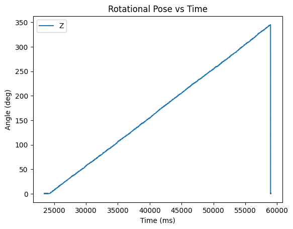
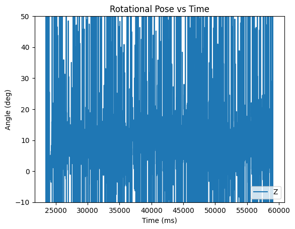
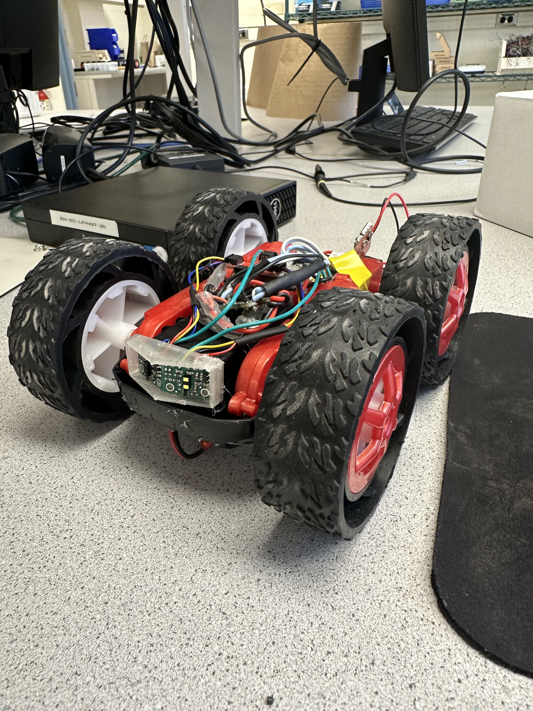
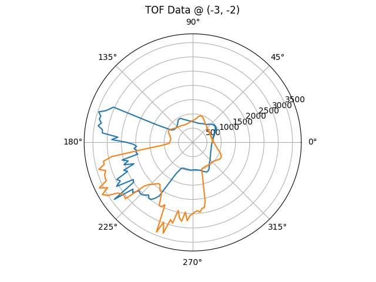
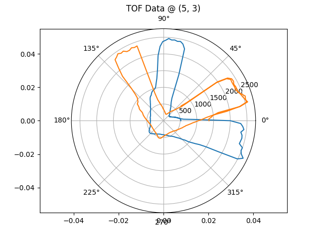
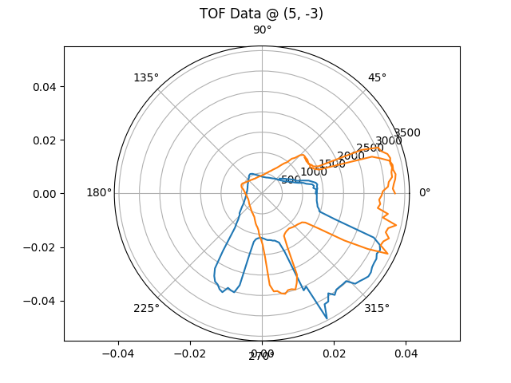
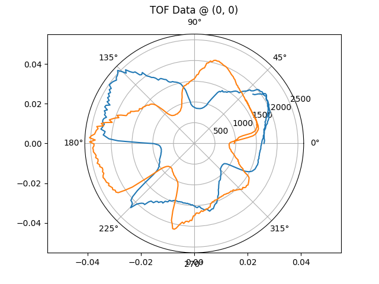
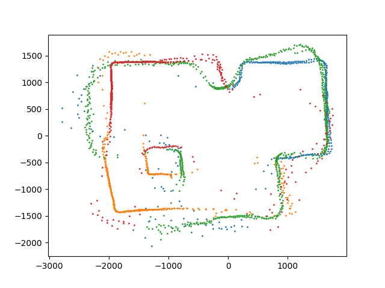
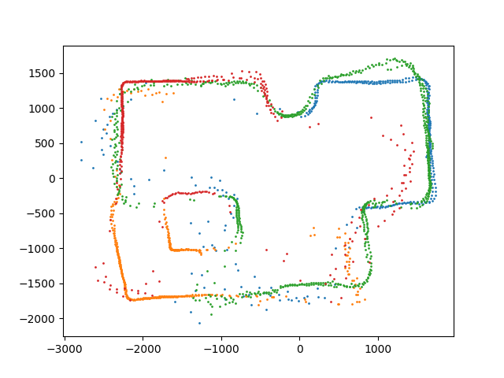
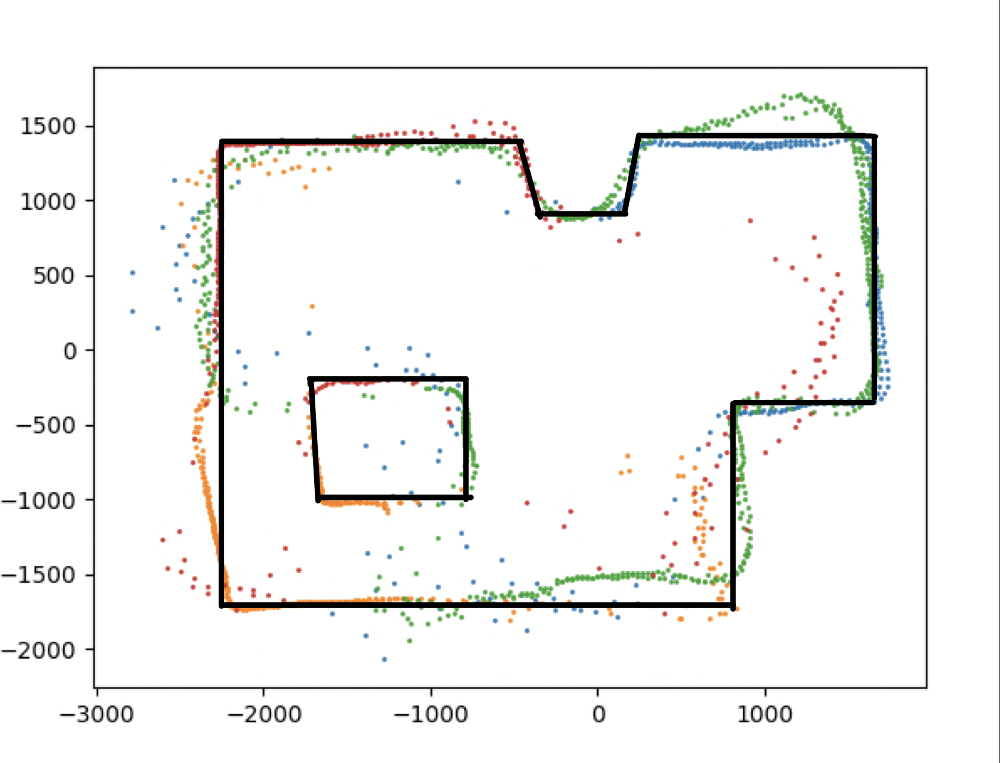

## Introduction

In this lab I used my car to create a map of a stationary room. By spinning the car slowly in a circle, I could record and transform the time of flight readings to generate a point cloud representing the walls.

## A Slow Turn

Make a cheep toy car turn slowly is not an easy feat. Luckily, I am armed with all of the techniques from the past labs. Because we want a slow and consistent spin, I chose to use [PID control](../lab_6) to control the angular speed of the robot. Slower rotation speed = higher resolution map, so I targeted a speed of 10 degrees per second.

Because I made my PID controller modular in part 6, setting up control for my rotational speed was easy:

```cpp
pid_controllers.pid[ROTATION].step(pid_controllers.setpoints[ROTATION], sensor_readings.gyro_delta.z);

float out = pid_controllers.pid[ROTATION].output;
set_wheel_output(out, -out);
```

Note that I'm setting the measurement for the PID controller to the raw gyro value, not the integrated value. Therefore, the set point is just 10 and I don't have to worry about integrated error.

The PID controller runs at 1 kHz with P = 0.01, I = 0.001, D = 0.0. The values were experimentally tuned.

Below is a video of a spin, along with graphs of the gyro output.

<iframe width="479" height="852" src="https://www.youtube.com/embed/0F4qw4jbwCE" title="ECE 4160 - Mapping Spin" frameborder="0" allow="accelerometer; autoplay; clipboard-write; encrypted-media; gyroscope; picture-in-picture; web-share" allowfullscreen></iframe>




> *Note: the second graph is mislabeled and shows the rotation speed of the car in deg/s*

You might notice that the rotational speed from the gyro is extremely noisy, but centered on 10. I could have low passed this value to get a smoother output, but it didn't effect the spin so I didn't bother. Despite the noise, the first graph shows that the rotation rate was smooth and consistent.

I then setup the car on four points around the room, made it spin, and recorded the TOF data.

## Understanding the Data

My car is setup with two TOF sensors on the front, angled 20 degrees outwards. Because of this arrangement, the following graphs have a rotational symmetry with an offset of about 40 degrees.



Spinning a full 360 took 36 seconds, during which time the TOF sensors returned 201 values from each sensor.






The graphs show shapes consistent with a the shape of the area, and has the expected 40 degree offset between the two TOFs. Additionally, the range values seem reasonable (> 0 and < 2.5 m).

## Generating a Map

The TOF readings I recorded are relative to the sensor's reference frame. For the map to be useful for navigation, we need to transform the data from the sensor frame to the world frame. Luckily, this is simple to achieve through some linear algebra.

To get from the sensor frame to the robot frame requires a rotation (the 20 degree skew) and a translation (the TOF are mounted to the front of center). Then we can go from the robot's frame to the inertial (world) frame through a second rotation and translation.

From the sensor frame to the robot frame we can use some simple trigonometry to get:

$$
\begin{bmatrix}
x_{robot} & y_{robot} 
\end{bmatrix}= 
\begin{bmatrix}
d \cdot cos(\pm 20) + 70 & d \cdot sin(\pm 20)
\end{bmatrix}
$$

Where d is the distance, or TOF reading, and 70 comes from how far forward the sensors are on the robot.

From the robot frame to the inertial frame, I used the following transformation matrix: 

$$
\begin{bmatrix}
x_{world} \\
y_{world} \\
1
\end{bmatrix}=
\begin{bmatrix}
cos(\theta) & -sin(\theta) & R_x \\
sin(\theta) & cos(\theta) & R_y \\
0 & 0 & 1
\end{bmatrix}
\begin{bmatrix}
x_{robot} \\
y_{robot} \\
1
\end{bmatrix}
$$

Where R and theta represent the robots coordinates in world space.

Combining the graphs gives:



I tweaked the robot rotation positions to account for poor measurement and calibration of the TOF, resulting in a better map:




Finally I fit some lines to the graph to represent a guess of the true location of the obstacles:

